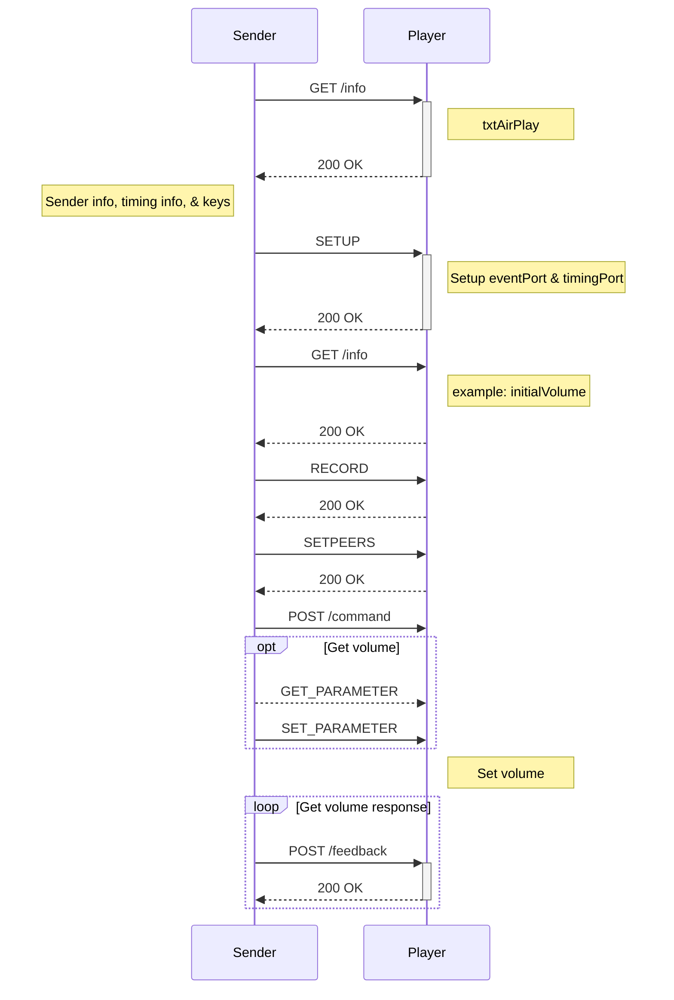

# Airplay 2 Internals 
> Note: Not official documentation
> Reference and s/o: https://emanuelecozzi.net/docs/airplay2/discovery/
>> This is my stripped down take with relation to the application

## Overview
AirPlay devices do service discovery through multicast DNS (mDNS) and the zeroconf protocol. (a.k.a. Bonjour) The communication between sender and receiver can take place on port 7000/TCP or on any other TCP port declared by the receiver in its mDNS record.

`_airplay._tcp`

The _airplay service appeared when AirPlay was initially introduced. This is also the service AirPlay 2 is currently using.

An AirPlay 2 sender inspects the following TXT records, including all the _raop._tcp entries and adding new ones. features is the most important record and controls what are the “inner” properties of an AirPlay receiver. It's analyzed in the following section, Features.

- [Airplay 2 Internals](#airplay-2-internals)
  - [Overview](#overview)
  - [Features](#features)
    - [Configurable bitmask](#configurable-bitmask)
    - [Other Features](#other-features)
    - [Minimal set of features](#minimal-set-of-features)
      - [Multi-room support](#multi-room-support)
      - [Metadata support](#metadata-support)
  - [Protocols](#protocols)
    - [RTSP](#rtsp)

|FromTXTRecord|	ToDict|	Type|	Explanation|
|----|---|----|---|
|fv	|firmwareVersion|	String|	Firmware version|
acl	|accessControlLevel	|Int64	|Access control level
btaddr|	bluetoothAddress|	String	|Bluetooth address
deviceid	|deviceID	|String	|Device ID
features	|features	|Int64	|Features
rsf	|requiredSenderFeatures|	Int64	|Required sender features
flags	|systemFlags|	Int64	|System flags
gcgl	|groupContainsDiscoverableLeader	|Boolean	|Group contains discoverable leader|
gid	|groupUUID	|String	|Group UUID
gpn|	groupPublicName	|String	|Group public name
igl	|isGroupLeader|	Boolean	|Is group leader
hgid|	homeGroupUUID|	String|	Home group UUID
hmid|	householdID|	String|	Household ID
pgcgl|	parentGroupContainsDiscoverableLeader|	Boolean|	Parent group contains discoverable leader|
pgid|	parentGroupUUID|	String|	Parent group UUID
tsid|	tightSyncUUID|	String	|Tight sync UUID
hkid|	homeKitHomeUUID|	String|	HomeKit home UUID
model|	deviceModel|	String|	Device model
manufacturer|	manufacturer	|String|	Manufacturer
serialNumber|	serialNumber	|String	|Serial number
protovers|	protocolVersion	String|	Protocol| version
pi	|publicCUAirPlayPairingIdentity|	String|	Public CU AirPlay pairing identity
psi	|publicCUSystemPairingIdentity	|String|	Public CU System Pairing Identity
pk	|publicKey|	String	|Public key
srcvers|	airPlayVersion|	String	|AirPlay version
osvers	|OSVersion|	String	|OS version

`_airplay-p2p._tcp.`

The _airplay-p2p service was introduced to stream content to Apple TVs without having to be connected to the same local network.

`_raop._tcp.`

RAOP stands for Remote Audio Output Protocol. The _raop service was introduced for audio streaming only when _airplay was supporting only photo and video streaming only

| FromTXTRecord | ToDict                  | Type    | Explanation               |
|---------------|-------------------------|---------|---------------------------|
| cn            | compressionTypes        | BitList | Compression types         |
| da            | rfc2617DigestAuthKey    | Boolean | RFC2617 digest auth key   |
| et            | encryptionTypes         | BitList | Encryption types          |
| ft            | features                | Int64   | Features                  |
| fv            | firmwareVersion         | String  | Firmware version          |
| sf            | systemFlags             | Int64   | System flags              |
| md            | metadataTypes           | BitList | Metadata types            |
| am            | deviceModel             | String  | Device model              |
| pw            | password                | Boolean | Password                  |
| pk            | publicKey               | String  | Public key                |
| tp            | transportTypes          | String  | Transport types           |
| vn            | airTunesProtocolVersion | String  | AirTunes protocol version |
| vs            | airPlayVersion          | String  | AirPlay version           |
| ov            | OSVersion               | String  | OS version                |
| vv            | vodkaVersion            | Int64   | Vodka version             |

## Features
### Configurable bitmask
Features are declared in the features field of the mDNS records as a 64 bits long bitfield and encoded as two 32 bits hex values separated by a comma. For example, the features set 0x1111111122222222 will be declared as "0x22222222,0x11111111".

>The following table is a listing of the features extracted so far. The column condition, if available, contains the necessary condition(s) to satisfy a specific feature.

| Bit | Property                              | Condition                                                                                    | Description        |
|-----|---------------------------------------|----------------------------------------------------------------------------------------------|--------------------|
| 0   | SupportsAirPlayVideoV1                |
| 1   | SupportsAirPlayPhoto                  |
| 5   | SupportsAirPlaySlideshow              |
| 7   | SupportsAirPlayScreen                 |
| 9   | SupportsAirPlayAudio                  |
| 11  | AudioRedunant                         |
| 14  | Authentication_4                      | FairPlay authentication                                                                      |
| 15  | MetadataFeatures_0                    | Send artwork image to receiver                                                               |
| 16  | MetadataFeatures_1                    | Send track progress status to receiver                                                       |
| 17  | MetadataFeatures_2                    | Send NowPlaying info via DAAP                                                                |
| 18  | AudioFormats_0                        |
| 19  | AudioFormats_1                        |
| 20  | AudioFormats_2                        |
| 21  | AudioFormats_3                        |
| 23  | Authentication_1                      | RSA authentication (NA)                                                                      |
| 26  | Authentication_8                      | 26 || 51                                                                                     | MFi authentication |
| 27  | SupportsLegacyPairing                 |
| 30  | HasUnifiedAdvertiserInfo              |
| 32  | IsCarPlay                             |
| 32  | SupportsVolume                        | !32                                                                                          |
| 33  | SupportsAirPlayVideoPlayQueue         |
| 34  | SupportsAirPlayFromCloud              | 34 &amp;&amp; flags_6_SupportsAirPlayFromCloud                                               |
| 35  | SupportsTLS_PSK                       |
| 38  | SupportsUnifiedMediaControl           |
| 40  | SupportsBufferedAudio                 | srcvers &gt;= 354.54.6 &amp;&amp; 40                                                         |
| 41  | SupportsPTP                           | srcvers &gt;= 366 &amp;&amp; 41                                                              |
| 42  | SupportsScreenMultiCodec              |
| 43  | SupportsSystemPairing                 |
| 44  | IsAPValeriaScreenSender               |
| 46  | SupportsHKPairingAndAccessControl     |
| 48  | SupportsCoreUtilsPairingAndEncryption | 38 || 46 || 43 || 48                                                                         |
| 49  | SupportsAirPlayVideoV2                |
| 50  | MetadataFeatures_3                    | Send NowPlaying info via bplist                                                              |
| 51  | SupportsUnifiedPairSetupAndMFi        |
| 52  | SupportsSetPeersExtendedMessage       |
| 54  | SupportsAPSync                        |
| 55  | SupportsWoL                           | 55 || 56                                                                                     |
| 56  | SupportsWoL                           | 55 || 56                                                                                     |
| 58  | SupportsHangdogRemoteControl          | ((isAppleTV || isAppleAudioAccessory) &amp;&amp; 58) || (isThirdPartyTV &amp;&amp; flags_10) |
| 59  | SupportsAudioStreamConnectionSetup    | 59 &amp;&amp; !disableStreamConnectionSetup                                                  |
| 60  | SupportsAudioMediaDataControl         | 59 &amp;&amp; 60 &amp;&amp; !disableMediaDataControl                                         |
| 61  | SupportsRFC2198Redundancy             |

### Other Features
> Some features are not associated to any bit, but they are rather tested over other feature bits and/or flags.

| Property                        | Condition                                                           | Description |
|---------------------------------|---------------------------------------------------------------------|-------------|
| AudioFormats                    | supportedFormats || (18 | 19 | 20 | 21)                             |
| SupportsAirPlayVideo            | 0 || 49                                                             |
| SupportsExtendedWHA             | srcvers &gt;= 366 &amp;&amp; (41 || forceAirPlay2NTP) &amp;&amp; 40 |
| ThirdPartySpeaker               | 26 || 51                                                            |
| ThirdPartyTV                    | (26 || 51) &amp;&amp; (0 || 49)                                     |
| SupportsTransientPairing        | 48 || 43                                                            |
| SupportsKeepAlive               | srcvers &gt;= 0.74.25                                               |
| SupportsCBCSEncryption          | srcvers &gt;= 301.44.30 &amp;&amp; len("OSversion") &gt; 0          | #wut        |
| SupportsUnifiedPairVerifyAndMFi | 51 &amp;&amp; srcvers &gt;= 377                                     |
| SupportsInitialVolume           | !32 &amp;&amp; srcvers &gt;= 120.2                                  |
| SupportsAirPlayVideoPausedStart | srcvers &gt;= 220.68                                                |
| SupportsMuteCommand             | srcvers &gt;= 370.35                                                |
| SupportsScreenIdle              | srcvers &gt;= 150.35                                                |

### Minimal set of features
#### Multi-room support
The minimal set of features an AirPlay 2 receiver must declare for multi-room support are:

    SupportsAirPlayAudio (bit 9)
    AudioRedundant (bit 11)
    HasUnifiedAdvertiserInfo (bit 30)
    SupportsBufferedAudio (bit 40)
    SupportsPTP (bit 41)
    SupportsUnifiedPairSetupAndMFi (bit 51)
The respective features bitmask is 0x8030040000a00 and will be declared as features=0x40000a00,0x80300.

#### Metadata support
The receiver can support metadata information by controlling bits 15, 16, 17 and 50:

    bit 15 - receive the artwork of the track currently played;
    bit 16 - receive the progress status;
    bit 17 - receive a set of #nowplaying info via DAAP1
    bit 50 - receive #nowplaying info encoded in a binary plist - overrides bit 17.

## Protocols

### RTSP
